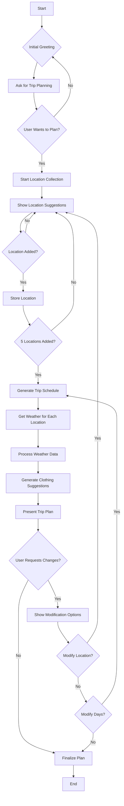
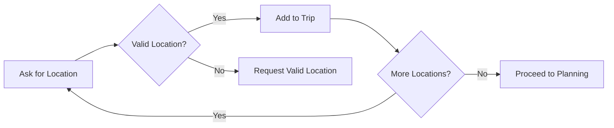
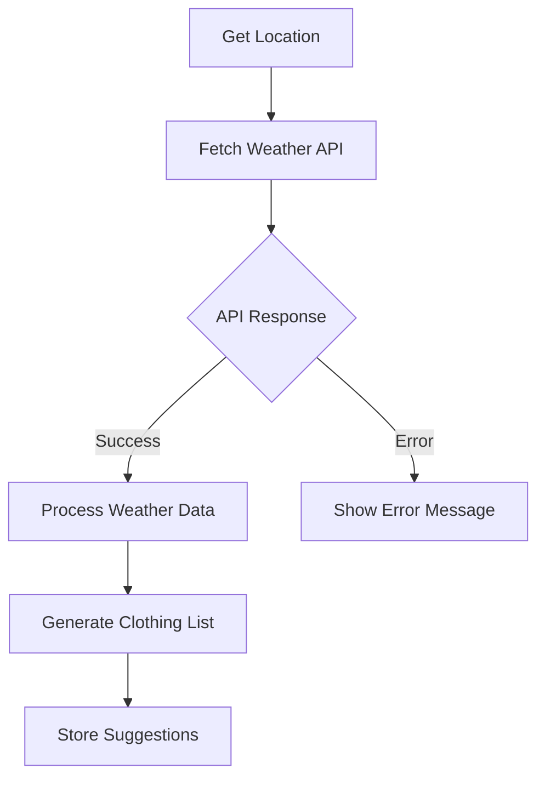
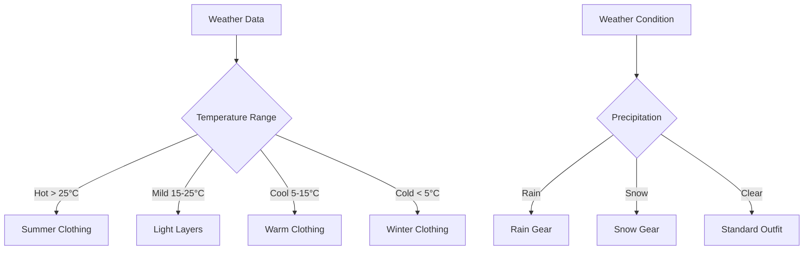
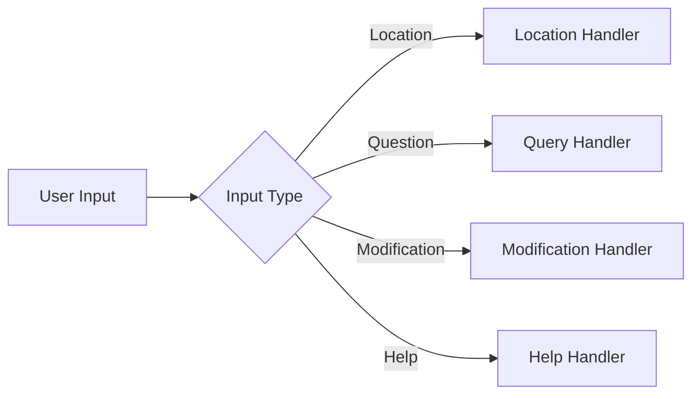
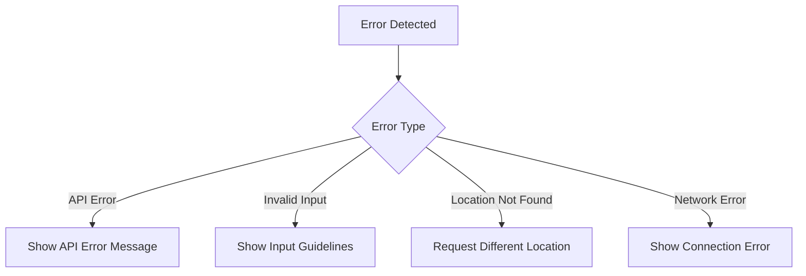

# Travel Weather Assistant Logic Flow

## Overview
This document outlines the logical flow and decision-making process of the Travel Weather Assistant chatbot. The bot helps users plan their trips by suggesting appropriate clothing based on weather conditions for multiple locations.

## Main Flow Components

### 1. Initial Interaction

### 2. Location Collection Phase

### 3. Weather Analysis Flow

### 4. Clothing Suggestion Logic

### 5. User Interaction Flow

### 6. Error Handling

## Detailed Component Descriptions

### 1. Input Processing
- **Text Input Validation**
  - Check for valid location names
  - Validate date formats
  - Verify numerical inputs
  
- **Command Recognition**
  - Identify user intentions
  - Parse command structures
  - Handle special commands
  
- **Suggestion Bubble Integration**
  - Display relevant suggestions
  - Handle suggestion clicks
  - Update UI accordingly
  
- **Context Maintenance**
  - Track conversation state
  - Maintain user preferences
  - Store temporary data

### 2. Weather Integration
- **API Call Handling**
  - Make API requests
  - Handle rate limiting
  - Implement retry logic
  
- **Data Parsing**
  - Extract relevant weather data
  - Convert units if needed
  - Format for display
  
- **Error Handling**
  - Handle API errors gracefully
  - Provide user feedback
  - Implement fallback options
  
- **Cache Management**
  - Cache weather data
  - Update stale data
  - Clear old cache entries

### 3. Trip Planning
- **Schedule Optimization**
  - Distribute locations across days
  - Consider travel time
  - Account for weather conditions
  
- **Location Validation**
  - Verify location exists
  - Check for duplicates
  - Validate coordinates
  
- **Day Distribution**
  - Balance locations per day
  - Consider user preferences
  - Optimize travel efficiency
  
- **Itinerary Generation**
  - Create daily schedules
  - Include weather forecasts
  - Add clothing suggestions

### 4. Clothing Suggestions
- **Temperature-Based Recommendations**
  - Hot weather clothing
  - Cold weather layers
  - Moderate temperature options
  
- **Weather Condition Analysis**
  - Rain protection
  - Sun protection
  - Wind protection
  
- **Activity-Appropriate Suggestions**
  - Casual wear
  - Active wear
  - Formal wear
  
- **Seasonal Considerations**
  - Summer essentials
  - Winter necessities
  - Transitional clothing

### 5. User Interface
- **Message Display**
  - Format messages clearly
  - Show timestamps
  - Indicate message status
  
- **Suggestion Bubbles**
  - Display relevant options
  - Handle interactions
  - Update dynamically
  
- **Loading Indicators**
  - Show processing state
  - Indicate API calls
  - Display progress
  
- **Error Messages**
  - Clear error descriptions
  - Suggested actions
  - Recovery options
  
- **Theme Handling**
  - Light/dark mode
  - Responsive design
  - Accessibility features

## Implementation Notes

### State Management
- Track conversation progress
- Store user preferences
- Maintain location list
- Handle session data

### API Integration
- Weather API configuration
- Error handling
- Rate limiting
- Data caching

### User Experience
- Clear instructions
- Helpful suggestions
- Error recovery
- Progress indication

### Testing Considerations
- Unit tests for components
- Integration tests
- Error scenario testing
- User interaction testing

## Future Enhancements
1. Additional weather data sources
2. More detailed clothing suggestions
3. Travel time calculations
4. Activity recommendations
5. Packing list generation 